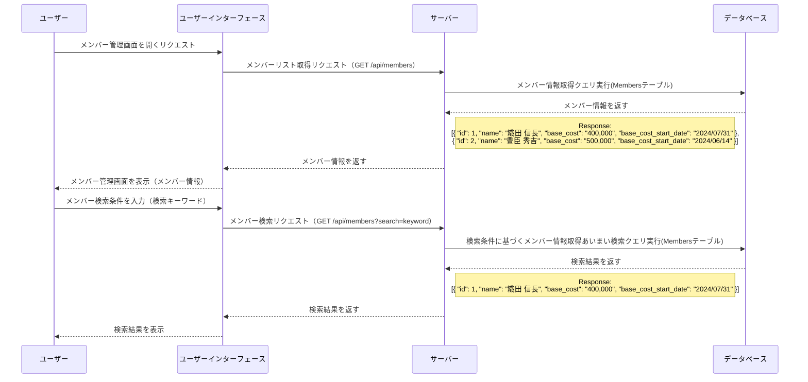

# メンバー画面
## シナリオ
1. 画面表示時
2. 検索時
##　シーケンス図

```mermaid
sequenceDiagram
    participant User as ユーザー
    participant UI as ユーザーインターフェース
    participant Server as サーバー
    participant DB as データベース

    User->>UI: メンバー管理画面を開くリクエスト
    UI->>Server: メンバーリスト取得リクエスト（GET /api/members）
    Server->>DB: メンバー情報取得クエリ実行(Membersテーブル)
    DB-->>Server: メンバー情報を返す
    note right of Server: Response: <br>[{ "id": 1, "name": "織田 信長", "base_cost": "400,000", "base_cost_start_date": "2024/07/31" },<br>{ "id": 2, "name": "豊臣 秀吉", "base_cost": "500,000", "base_cost_start_date": "2024/06/14" }]
    Server-->>UI: メンバー情報を返す
    UI-->>User: メンバー管理画面を表示（メンバー情報）

    User->>UI: メンバー検索条件を入力（検索キーワード）
    UI->>Server: メンバー検索リクエスト（GET /api/members?search=keyword）
    Server->>DB: 検索条件に基づくメンバー情報取得あいまい検索クエリ実行(Membersテーブル)
    DB-->>Server: 検索結果を返す
    note right of Server: Response: <br>[{ "id": 1, "name": "織田 信長", "base_cost": "400,000", "base_cost_start_date": "2024/07/31" }]
    Server-->>UI: 検索結果を返す
    UI-->>User: 検索結果を表示
```
