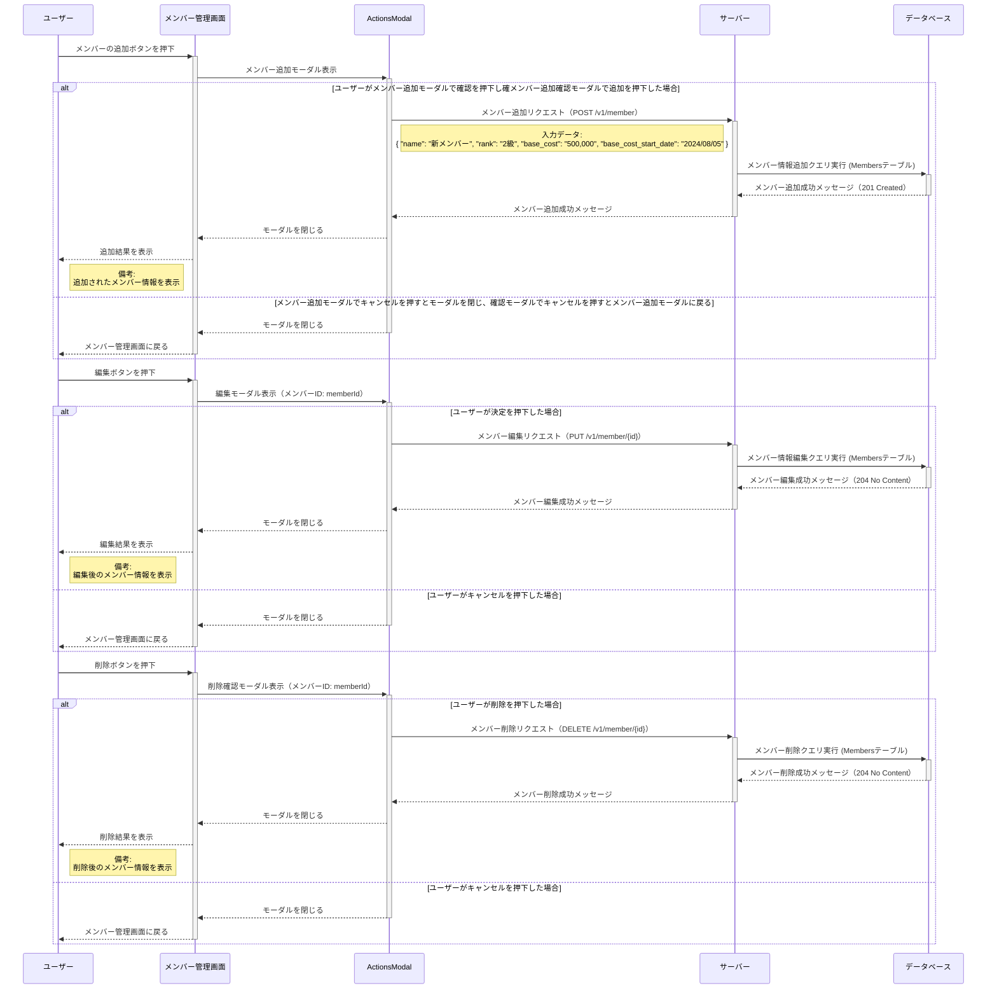

# メンバー画面
## シナリオ
3. メンバー追加
4. メンバー編集
5. メンバー削除
## シーケンス図

```mermaid
sequenceDiagram
    participant User as ユーザー
    participant UI as メンバー管理画面
    participant Modal as ActionsModal
    participant Server as サーバー
    participant DB as データベース

    User->>+UI: メンバーの追加ボタンを押下
    UI->>+Modal: メンバー追加モーダル表示
        alt ユーザーがメンバー追加モーダルで確認を押下し確メンバー追加確認モーダルで追加を押下した場合
        Modal->>+Server: メンバー追加リクエスト（POST /v1/member）
        note right of Modal: 入力データ: <br>{ "name": "新メンバー", "rank": "2級", "base_cost": "500,000", "base_cost_start_date": "2024/08/05" }
        Server->>+DB: メンバー情報追加クエリ実行 (Membersテーブル)
        DB-->>-Server: メンバー追加成功メッセージ（201 Created）
        Server-->>-Modal: メンバー追加成功メッセージ
        Modal-->>UI: モーダルを閉じる
        UI-->>User: 追加結果を表示
        note right of User: 備考: <br>追加されたメンバー情報を表示
    else メンバー追加モーダルでキャンセルを押すとモーダルを閉じ、確認モーダルでキャンセルを押すとメンバー追加モーダルに戻る
        Modal-->>-UI: モーダルを閉じる
        UI-->>-User: メンバー管理画面に戻る
    end

    User->>+UI: 編集ボタンを押下
    UI->>+Modal: 編集モーダル表示（メンバーID: memberId）
    alt ユーザーが決定を押下した場合
        Modal->>+Server: メンバー編集リクエスト（PUT /v1/member/{id}）
        Server->>+DB: メンバー情報編集クエリ実行 (Membersテーブル)
        DB-->>-Server: メンバー編集成功メッセージ（204 No Content）
        Server-->>-Modal: メンバー編集成功メッセージ
        Modal-->>UI: モーダルを閉じる
        UI-->>User: 編集結果を表示
        note right of User: 備考: <br>編集後のメンバー情報を表示
    else ユーザーがキャンセルを押下した場合
        Modal-->>-UI: モーダルを閉じる
        UI-->>-User: メンバー管理画面に戻る
    end


    User->>+UI: 削除ボタンを押下
    UI->>+Modal: 削除確認モーダル表示（メンバーID: memberId）
    alt ユーザーが削除を押下した場合
        Modal->>+Server: メンバー削除リクエスト（DELETE /v1/member/{id}）
        Server->>+DB: メンバー削除クエリ実行 (Membersテーブル)
        DB-->>-Server: メンバー削除成功メッセージ（204 No Content）
        Server-->>-Modal: メンバー削除成功メッセージ
        Modal-->>UI: モーダルを閉じる
        UI-->>User: 削除結果を表示
        note right of User: 備考: <br>削除後のメンバー情報を表示
    else ユーザーがキャンセルを押下した場合
        Modal-->>-UI: モーダルを閉じる
        UI-->>-User: メンバー管理画面に戻る
    end
    
```
