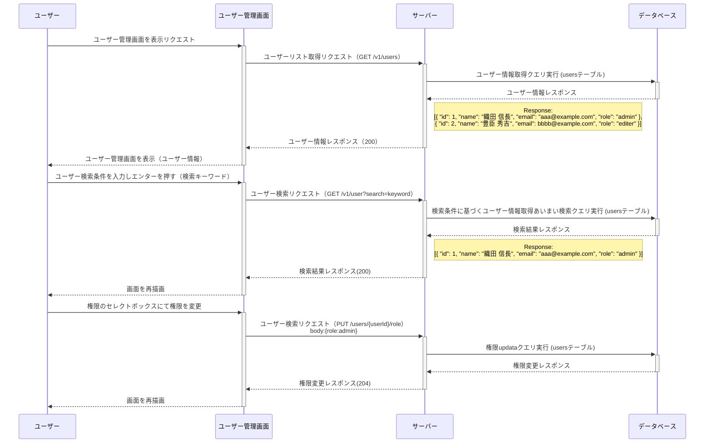

# ユーザー管理画面
## シナリオ
1. 画面表示時
2. 氏名フィルター時
3. 権限変更
## シーケンス図

```mermaid
sequenceDiagram
    participant User as ユーザー
    participant UI as ユーザー管理画面
    participant Server as サーバー
    participant DB as データベース

    User->>+UI: ユーザー管理画面を表示リクエスト
    UI->>+Server: ユーザーリスト取得リクエスト（GET /v1/users）
    Server->>+DB: ユーザー情報取得クエリ実行 (usersテーブル)
    DB-->>-Server: ユーザー情報レスポンス
    note right of Server: Response: <br>[{ "id": 1, "name": "織田 信長", "email": "aaa@example.com", "role": "admin" },<br>{ "id": 2, "name": "豊臣 秀吉", "email": bbbb@example.com", "role": "editer" }]
    Server-->>-UI: ユーザー情報レスポンス（200）
    UI-->>-User: ユーザー管理画面を表示（ユーザー情報）

    User->>+UI: ユーザー検索条件を入力しエンターを押す（検索キーワード）
    UI->>+Server: ユーザー検索リクエスト（GET /v1/user?search=keyword）
    Server->>+DB: 検索条件に基づくユーザー情報取得あいまい検索クエリ実行 (usersテーブル)
    DB-->>-Server: 検索結果レスポンス
    note right of Server: Response: <br>[{ "id": 1, "name": "織田 信長", "email": "aaa@example.com", "role": "admin" }]
    Server-->>-UI: 検索結果レスポンス(200)
    UI-->>-User: 画面を再描画

    User->>+UI: 権限のセレクトボックスにて権限を変更
    UI->>+Server: ユーザー検索リクエスト（PUT /users/{userId}/role）<br>body:{role:admin}
    Server->>+DB: 権限updataクエリ実行 (usersテーブル)
    DB-->>-Server: 権限変更レスポンス
    Server-->>-UI: 権限変更レスポンス(204)
    UI-->>-User: 画面を再描画
```
