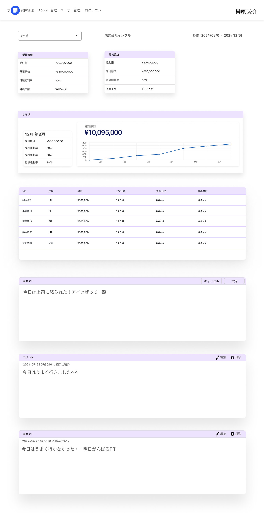

# ホーム画面要件書

## 機能

- 受注(見積)情報表示機能
- 着地見込表示/計算機能
- 着地見込グラフ表示機能
- アサインメンバー実績/予定確認
- コメント表示/投稿/削除/編集機能

### 機能ロジック詳細

- 見積粗利率: estimationsテーブルのestimate_cost/(estimationsテーブルのorder_price + estimationsテーブルのestimate_cost)
- 着地原価: 実績原価/実績工数*残工数 + 実績原価
- 実績原価: work_costsテーブルの該当のproject_idのdaily_costの合計値
- 実績工数: work_costsテーブルの該当のproject_idのwork_timeの合計値を人月に換算(160で割ったもの)したもの
- 残工数: estimationsテーブルのestimate_person_month - 実績工数
- グラフ:
  - X軸: projectsテーブルのstart_dateからprojectsテーブルのend_dateの範囲を表示
  - Y軸: 0から見積原価の1.2倍の値の範囲を表示
  - 折れ線A: assignment_member_monthly_estimationsテーブルのtarget_month毎のestimate_person_monthの合計値の点をtarget_month毎に打つ
  - 折れ線B: work_costsテーブルの該当のproject_idのtarget_monthと同じ月のwork_dateの合計値の点をtarget_month毎に打つ
- 予定工数: assignment_member_monthly_estimationsテーブルのassignment_member_id毎のestimate_person_monthの合計値
- 積算工数: work_costsテーブルの該当のassignment_member_idのwork_timeの合計値を人月に換算(160で割ったもの)したもの
- 積算原価: work_costsテーブルの該当のassignment_member_idのdaily_costの合計値

## 画面仕様書

### 1. 画面名

画面名:ホーム画面
Path: /home

### 2. 画面概要

案件毎のの受注(見積)情報を表示した上で実績をもとに案件終了時の利益率の予測をグラフ形式で表示する。  
案件毎にコメントをつけることができる。

### 3. UI構成

レイアウト:



項目:

項目名|種別|型|必須|I/O|バリデーション|初期値|備考|
-----|----|----|----|----|----|----|----|
案件選択|プルダウン|文字列|-|I/O|-|-|選択肢は全てのプロジェクト名/プルダウン選択時に文字入力で検索可能(フロント側で制御)/内部的にはproject_idで管理|
期間|テキスト|-|-|O|-|-|projectsテーブルのstart_dateとend_dateを表示|
受注情報|テーブル|-|-|O|-|-|-|
受注情報 / 受注額(ラベル)|テキスト|文字列|-|O|-|-|-|
受注情報 / 受注額(数字)|テキスト|文字列|-|O|-|-|フォーマット: ¥ XXX,XXX/estimationsテーブルのorder_price|
受注情報 / 見積原価(ラベル)|テキスト|文字列|-|O|-|-|-|
受注情報 / 見積原価(数字)|テキスト|文字列|-|O|-|-|フォーマット: ¥ XXX,XXX/estimationsテーブルのestimate_cost|
受注情報 / 見積粗利率(ラベル)|テキスト|文字列|-|O|-|-|-|
受注情報 / 見積粗利率(数字)|テキスト|文字列|-|O|-|-|フォーマット: XX%/機能ロジック詳細の見積粗利率参照|
受注情報 / 見積工数(ラベル)|テキスト|文字列|-|O|-|-|-|
受注情報 / 見積工数(数字)|テキスト|文字列|-|O|-|-|フォーマット: ¥ XX.XX人月/estimationsテーブルのestimate_person_month|
着地見込|テーブル|-|-|O|-|-|-|
着地見込 / 粗利額(ラベル)|テキスト|文字列|-|O|-|-|-|
着地見込 / 粗利額(数字)|テキスト|文字列|-|O|-|-|フォーマット: ¥ XXX,XXX/受注額 - 着地原価|
着地見込 / 着地原価(ラベル)|テキスト|文字列|-|O|-|-|-|
着地見込 / 着地原価(数字)|テキスト|文字列|-|O|-|-|フォーマット: ¥ XXX,XXX/機能ロジック詳細の着地原価参照|
着地見込 / 着地粗利率(ラベル)|テキスト|文字列|-|O|-|-|-|
着地見込 / 着地粗利率(数字)|テキスト|文字列|-|O|-|-|フォーマット: XX%|
着地見込 / 実績工数(ラベル)|テキスト|文字列|-|O|-|-|-|
着地見込 / 実績工数(数字)|テキスト|文字列|-|O|-|-|フォーマット: XX.XX人月/機能ロジック詳細の実績工数参照|
サマリ|-|-|-|O|-|-|-|
サマリ / 対象週|テキスト|文字列|-|O|-|-|フォーマット: XX月XX日|
サマリ / 見積原価(ラベル)|テキスト|文字列|-|O|-|-|-|
サマリ / 見積原価(数字)|テキスト|文字列|-|O|-|-|フォーマット: ¥ XXX,XXX/estimationsテーブルのestimate_cost|
サマリ / 実績原価(ラベル)|テキスト|文字列|-|O|-|-|-|
サマリ / 実績原価(数字)|テキスト|文字列|-|O|-|-|フォーマット: ¥ XXX,XXX/機能ロジック詳細の実績原価参照|
サマリ / 実績工数(ラベル)|テキスト|文字列|-|O|-|-|-|
サマリ / 実績工数(数字)|テキスト|文字列|-|O|-|-|フォーマット: XX.XX人月/機能ロジック詳細の実績工数参照|
サマリ / 残工数(ラベル)|テキスト|文字列|-|O|-|-|-|
サマリ / 残工数(数字)|テキスト|文字列|-|O|-|-|フォーマット: XX.XX人月/機能ロジック詳細の残工数参照|
サマリ / グラフ|グラフ|-|-|O|-|-|-|
サマリ / グラフ / 合計原価(ラベル)|テキスト|-|-|O|-|-|-|
サマリ / グラフ / 合計原価(数字)|テキスト|-|-|O|-|-|フォーマット: ¥ XXX,XXX/機能ロジック詳細の実績原価参照|
サマリ / グラフ / グラフ|-|-|-|O|-|-|機能ロジック詳細のグラフ参照|
メンバー情報|テーブル|-|-|O|-|-|-|
メンバー情報 / 氏名(列)|テキスト|-|-|O|-|-|-|
メンバー情報 / 役職(列)|テキスト|-|-|O|-|-|-|
メンバー情報 / 原価(列)|テキスト|-|-|O|-|-|-|
メンバー情報 / 予定工数(列)|テキスト|-|-|O|-|-|-|
メンバー情報 / 稼働工数(列)|テキスト|-|-|O|-|-|-|
メンバー情報 / 積算原価(列)|テキスト|-|-|O|-|-|-|
メンバー情報 / 氏名(行)|テキスト|-|-|O|-|-|membersテーブルのname|
メンバー情報 / 役職(行)|テキスト|-|-|O|-|-|assignment_membersテーブルのposition|
メンバー情報 / 原価(行)|テキスト|-|-|O|-|-|フォーマット: ¥ XXX,XXX|
メンバー情報 / 予定工数(行)|テキスト|-|-|O|-|-|フォーマット: XX.XX人月/機能ロジック詳細の予定工数参照|
メンバー情報 / 積算工数(行)|テキスト|-|-|O|-|-|フォーマット: XX.XX人月/機能ロジック詳細の積算工数工数参照|
メンバー情報 / 積算原価(行)|テキスト|-|-|O|-|-|フォーマット: ¥ XXX,XXX/機能ロジック詳細の積算原価工数参照|
コメント|-|-|-|O|-|-|-|
コメント / コメント|テキスト|-|-|O|-|-|-|
コメント / 新規作成|ボタン|-|-|O|-|-|-|
コメント / 編集|ボタン|-|-|O|-|-|-|
コメント / 削除|ボタン|-|-|O|-|-|-|
コメント / キャンセル|ボタン|-|-|O|-|-|-|
コメント / 決定|ボタン|-|-|O|-|-|-|
コメント / 入力フィールド|テキスト/テキストボックス|-|-|I/O|1000文字以内|-|-|

### 4. イベント

- 初期表示
  - projectsテーブルの中で現時点以降の終了日(end_date)が最も近いデータから昇順で一番上のデータのidをホーム画面情報取得APIにリクエスト
    - ホーム画面情報取得APIで取得した情報を表示
- 案件選択
  - プルダウンから案件を選択(クリック)した時点でホーム画面情報取得APIで情報を取得し表示
- コメント新規作成ボタン押下
  - 新しいコメントの入力フィールドを生成する
  - 決定ボタンを押下
    - コメント登録APIから登録後、コメント一覧取得APIで情報を取得し表示
  - キャンセルボタンを押下
    - コメントの入力フィールドを消す
- コメント編集ボタン押下
  - 既存のコメントの入力フィールドの入力を受け付ける
  - 決定ボタンを押下
    - 該当コメントのidを取得し、コメント編集APIから編集後、コメント一覧取得APIで情報を取得し表示
  - キャンセルボタンを押下
    - コメントの入力フィールドを消す
- コメント削除ボタン押下
  - 該当コメントのidを取得し、コメント削除APIから削除後、コメント一覧取得APIで情報を取得し表示

## API仕様書

### 1. API一覧

API名|HTTPメソッド|URI|説明|
-----|----|----|----|
ホーム画面情報取得|GET|/v1/home/{id}|ホーム画面に表示する情報をコメント以外取得する|
コメント一覧取得|GET|/v1/comment|コメントの一覧を取得する|
コメント登録|POST|/v1/comment|コメントの登録を行う|
コメント編集|PUT|/v1/comment/{id}|コメントの編集を行う|
コメント削除|DELETE|/v1/comment/{id}|コメントの削除を行う|

### 2. リクエスト仕様

#### ホーム画面情報取得

##### リクエストパラメータ

パラメータ名|型|必須/任意|デフォルト値|備考|
-----|----|----|----|----|
-|-|-|-|URIにidを含む|

###### リクエストボディ例

```json
{}
```

#### コメント一覧取得

##### リクエストパラメータ

パラメータ名|型|必須/任意|デフォルト値|備考|
-----|----|----|----|----|
-----|----|----|----|----|

###### リクエストボディ例

```json
[]
```

#### コメント登録

##### リクエストパラメータ

パラメータ名|型|必須/任意|デフォルト値|備考|
-----|----|----|----|----|
comment|文字列|◯|-|-|

###### リクエストボディ例

```json
{
  "comment": "今日は上司に怒られた！アイツぜってー殴ったりなんかしないよ！大人だもの"
}
```

#### コメント編集

##### リクエストパラメータ

パラメータ名|型|必須/任意|デフォルト値|備考|
-----|----|----|----|----|
comment|文字列|◯|-|URIにidを含む|

###### リクエストボディ例

```json
{
  "comment": "今日はうまく行きました^ ^"
}
```

#### コメント削除

##### リクエストパラメータ

パラメータ名|型|必須/任意|デフォルト値|備考|
-----|----|----|----|----|
-|-|-|-|URIにidを含む|

###### リクエストボディ例

```json
{}
```

### 3. レスポンス仕様

#### ホーム画面情報取得

ステータスコード: `200`

##### レスポンスフィールド

 フィールド名 | 型 | 備考 |
 ------------ | ---- | ---- |
 projects | object | ---- |
 projects.id | integer | プロジェクトのID |
 projects.freee_project_code | string | プロジェクトコード |
 projects.name | string | 案件名 |
 projects.start_date | string | プロジェクト開始日 |
 projects.end_date | string | プロジェクト終了日 |
 projects.estimations | object | 受注情報 |
 projects.estimations.order_price | int | 受注額 |
 projects.estimations.estimate_cost | int | 見積原価 |
 projects.estimations.estimate_person_month | int | 見積工数（人月） |
 projects.forecast | object | 着地見込 |
 projects.forecast.forecast_profit | int | 予測粗利額 / 受注額 - 着地原価|
 projects.forecast.forecast_cost | int | 着地原価 / 機能ロジック詳細の着地原価参照|
 projects.forecast.achievement_person_month | int | 実績工数 / 機能ロジック詳細の実績工数参照 |
 projects.summary | object | サマリー |
 projects.summary.total_estimate_cost | int | 見積原価 |
 projects.summary.total_achievement_cost | int | 実績原価 / 機能ロジック詳細の実績原価参照 |
 projects.summary.achievement_person_month | int | 実績工数 / 機能ロジック詳細の実績工数参照 |
 projects.summary.Remaining_person_month | int | 残工数 / 機能ロジック詳細の残工数参照 |
 projects.summary.graph | array | グラフ |
 projects.summary.graph.target_month | string | 対象月 |
 projects.summary.graph.achievement_cost | int | 実績原価 / 機能ロジック詳細のグラフ.折れ線B参照 |
 projects.summary.graph.estimate_cost | int | 見積原価 |
 projects.assignment_members | array | メンバー |
 projects.assignment_members.member_id | integer | メンバーid |
 projects.assignment_members.name | integer | 名前 |
 projects.assignment_members.position | integer | ポジション |
 projects.assignment_members.base_cost | int | 原価 |
 projects.assignment_members.estimate_total_person_month | int | 予定工数 / 機能ロジック詳細の予定工数参照|
 projects.assignment_members.achievement_total_person_month | int | 積算工数 / 機能ロジック詳細の積算工数工数参照 |
 projects.assignment_members.achievement_total_cost | int | 積算原価 / 機能ロジック詳細の積算原価工数参照|
 projects.outsources | array | 外注 |
 projects.outsources.name | string | 内容 |
 projects.outsources.estimate_cost | int | 外注見積原価 |
 projects.outsources.cost | int | 外注実績原価 |

##### レスポンス例

```json
{
  "projects":
        {
            "id": 1,
            "freee_project_code": "00-00-00000-000000-000",
            "name": "請負管理アプリ",
            "start_date": "2024-07-01",
            "end_date": "2024-08-31",
            "estimations":
              {
                "order_price":30000000,
                "estimate_cost":20000000,
                "estimate_person_month":16.00,
              },
            "forecast":
              {
                "forecast_profit":10000000,
                "forecast_cost":20000000,
                "achievement_person_month":7.50,
              },
            "summary":
              {
                "total_estimate_cost":30000000,
                "total_achievement_cost":10000000,
                "achievement_person_month":7.50,
                "Remaining_person_month":8.50,
                "graph":
                [
                  {
                  "target_month":"2024/8",
                  "achievement_cost":10095000,
                  "estimate_cost":13000000,
                  },
                  ...
                ]
              },
            "assignment_members": [
            {
            "member_id": 1,
            "name": "田中太郎",
            "position": 1,
            "base_cost": 6,
            "estimate_total_person_month": 6.0,
            "achievement_total_person_month": 0.6,
            "achievement_total_cost": 240000,
            },
            ...,
            ],
            "outsources": [
            {
              "name": "デザイン外注",
              "estimate_cost": 400000,
              "cost": 300000,
            },
            ...,
            ]
        },
}
```

##### エラーレスポンス

エラーコード|メッセージ例|説明|
-----|----|----|
404|該当のidのデータは存在しません|不正な値に関しても返却|

##### エラーレスポンス例

```json
{
  "errors": {
    "message":"該当のidのデータは存在しません"
    }
}
```

#### コメント一覧取得

ステータスコード: `200`

##### レスポンスフィールド

フィールド名 | 型 | 備考 |
------------ | ---- | ---- |
id| int | コメントid |
comment| string | コメント内容|
created_at| string | コメント作成日時|
updated_at| string | コメント更新日時|

##### レスポンス例

```json
{
  "comments": [
    {
      "id": 1,
      "comment": "これはサンプルコメントです。",
      "created_at": "2024-09-25T12:34:56Z",
      "updated_at": "2024-09-25T12:34:56Z"
    },
    ...
  ]
}

```

##### エラーレスポンス

エラーコード|メッセージ例|説明|
-----|----|----|
500|サーバーエラーが発生しました。|サーバー側での予期しないエラー|

##### エラーレスポンス例

```json
{
  "errors": {
        "message": "サーバーエラーが発生しました。"
    }
}
```

#### コメント登録

ステータスコード: `200`

##### レスポンスフィールド

フィールド名 | 型 | 備考 |
------------ | ---- | ---- |
------------ | ---- | ---- |

##### レスポンス例

```json
[]
```

##### エラーレスポンス

エラーコード|メッセージ例|説明|
-----|----|----|
422|コメントは100文字以内にしてください|不正な値に関しても返却|

##### エラーレスポンス例

```json
{
  "errors": {
        "comment": [
            "コメントは100文字以内にしてください"
        ]
    }
}
```

#### コメント編集

ステータスコード: `204`

##### レスポンスフィールド

フィールド名|型|備考|
-----|----|----|
-|-|-|

##### レスポンス例

```json
[]
```

##### エラーレスポンス

エラーコード|メッセージ|説明|
-----|----|----|
400|該当のidのコメントは存在しません。|-|
422|コメントは100文字以内にしてください|不正な値に関しても返却|

```json
{
  "errors": {
        "comment": "コメントは100文字以内にしてください"
    }
}
```


#### コメント削除

ステータスコード: `204`

##### レスポンスフィールド

フィールド名|型|備考|
-----|----|----|
-|-|-|

##### レスポンス例

```json
[]
```

##### エラーレスポンス

エラーコード|メッセージ|説明|
-----|----|----|
400|該当のidのコメントは存在しません。|-|

```json
{
  "errors": {
        "message": "該当のidのコメントは存在しません。"
    }
}
```

### 4. 備考

備考:  
見込み計算ロジックはバックエンド/フロントエンドどちらで行うかは要検討
