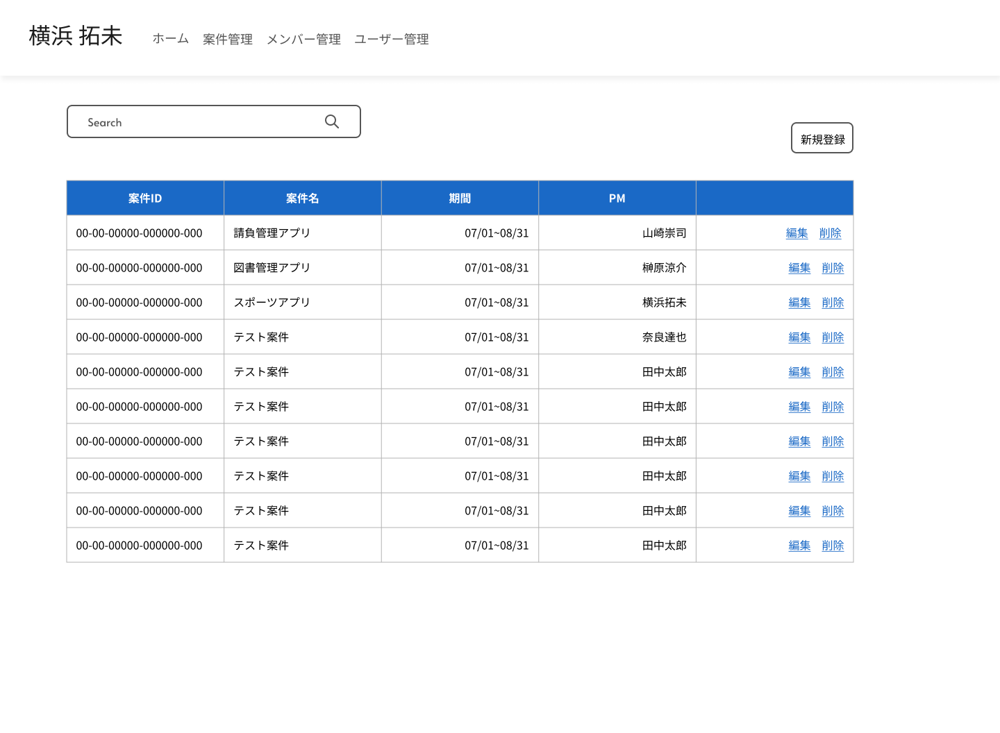

# 案件管理画面要件書

## 機能

- 案件一覧表示
- 案件検索

## 画面仕様書

### 1. 画面名

画面名:案件管理画面
Path: /projects

### 2. 画面概要

全ての案件情報を表示し、検索できる  

### 3. UI構成

レイアウト:



項目:
項目名|種別|型|必須|I/O|バリデーション|初期値|備考|
-----|----|----|----|----|----|----|----|
検索Box|検索Box|-|-|I|-|-|-|
検索Box / 入力Box|テキストボックス|文字列|-|I|255文字以内|-|-|
検索Box / 検索アイコン|ボタン|-|-|O|-|-|-|
新規登録|ボタン|-|-|O|-|-|-|
案件一覧|テーブル|-|-|O|-|-|-|
案件一覧 / 案件ID|テキスト|文字列|-|O|-|-|ソート機能あり|
案件一覧 / 案件名|テキスト|文字列|-|O|-|-|ソート機能あり|
案件一覧 / 期間|テキスト|文字列|-|O|-|-|ソート機能あり|
案件一覧 / PM|テキスト|文字列|-|O|-|-|ソート機能あり|
案件一覧 / 入力|ボタン|-|-|O|-|-|-|
案件一覧 / 編集|ボタン|-|-|O|-|-|-|

### 4. イベント

- 初期表示
  - 現時点以降の終了日が最も近いデータから昇順で表示
- 検索
  - テキストボックスに入力された文字列から案件名で検索
- 新規登録ボタン押下
  - 案件登録画面に遷移
- 編集ボタン押下
  - 案件編集画面に遷移
- 削除ボタン押下
  - 削除確認モーダルが表示され、モーダルの決定ボタンを押下すると削除する

## API仕様書

### 1. API一覧

API名|HTTPメソッド|URI|説明|
-----|----|----|----|
案件検索|GET|/v1/projects|検索条件をクエリストリングに含み検索を行う|
案件削除|DELETE|/v1/projects/{id}|指定のIDのprojectsを論理削除する|

### 2. リクエスト仕様

#### 案件検索

##### リクエストパラメータ

パラメータ名|型|必須/任意|デフォルト値|備考|
-----|----|----|----|----|
-|-|-|-|クリエストリングで条件を渡す|

###### リクエストボディ例

```json
{}
```

#### 案件削除

##### リクエストパラメータ

パラメータ名|型|必須/任意|デフォルト値|備考|
-----|----|----|----|----|
-|-|-|-|URIにidを含む|

###### リクエストボディ例

```json
{}
```

### 3. レスポンス仕様

#### 案件検索

ステータスコード: `200`

##### レスポンスフィールド

フィールド名|型|備考|
-----|----|----|
projects[]|配列|----|
projects[] / id|integer|----|
projects[] / freee_project_code|string|----|
projects[] / name|string|----|
projects[] / start_date|date|----|
projects[] / end_date|date|----|
projects[] / project_manager|string|projects->assignment_membersのリレーションでpositionがPMのメンバーを取得|

##### レスポンス例

```json
{
  "projects": [
        {
            "id": 1,
            "freee_project_code": "00-00-00000-000000-000",
            "name": "請負管理アプリ",
            "start_date": "2024-07-01",
            "end_date": "2024-08-31",
            "project_manager": "佐藤太郎",
        },
        ...,
  ]
}
```

##### エラーレスポンス

エラーコード|メッセージ例|説明|
-----|----|----|
400|リクエストの値が不正です。|不正な値に関しても返却|
404|条件に該当するデータはありませんでした。|-|

##### エラーレスポンス例

```json
{
  "errors": {
        "start_date": [
            "開始日の値が不正です。"
        ]
    }
}
```

#### 案件削除

ステータスコード: `204`

##### レスポンスフィールド

フィールド名|型|備考|
-----|----|----|
-|-|-|

##### レスポンス例

```json
[]
```

##### エラーレスポンス

エラーコード|メッセージ|説明|
-----|----|----|
400|削除対象のリソースは存在しません。|不正な値に関しても返却|
403|対象のリソースの削除を許可されていません。|-|

```json
{
  "errors": "削除対象のリソースは存在しません。"
}
```

### 4. 備考

備考: 
