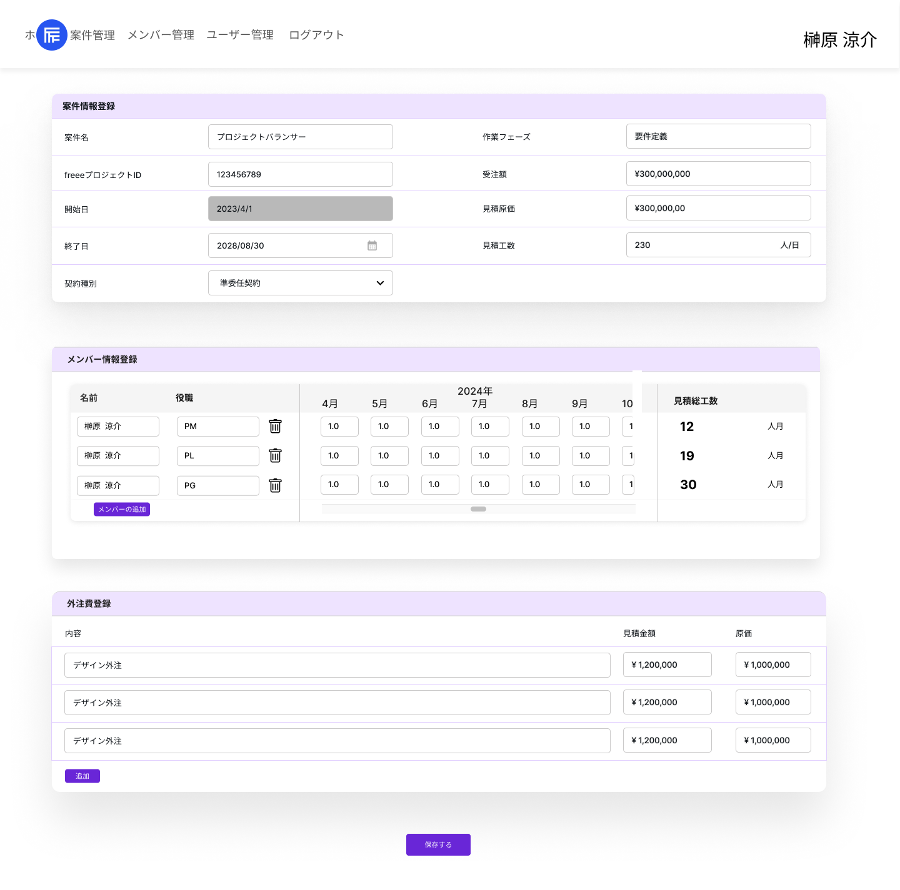

# 案件編集画面要件書

## 機能

- 案件詳細
- 案件編集

## 画面仕様書

### 1. 画面名

画面名:案件編集画面
Path: /projects/edit/{id}

### 2. 画面概要

個別の案件情報(見積情報,メンバー登録,外注費)を確認・編集できる  

### 3. UI構成

レイアウト:



項目:
項目名|種別|型|必須|I/O|バリデーション|初期値|備考|
-----|----|----|----|----|----|----|----|
案件情報登録|テーブル|-|-|I|-|-|-|
案件情報登録 / 案件情報登録|テキスト|文字列|-|O|-|-|-|
案件情報登録 / 案件名|テキストボックス|文字列|-|I|255文字以内|-|-|
案件情報登録 / freeeプロジェクトID|テキストボックス|文字列|-|I|50文字以内|-|-|
案件情報登録 / 開始日|テキスト|日付|-|O|-|-|変更不可/フォーマット: YYYY/MM/DD|
案件情報登録 / 終了日|デイトピッカー|日付|-|I|-|-|フォーマット: YYYY/MM/DD|
案件情報登録 / 作業フェーズ|プルダウン|文字列|-|I|-|-|内部的には数値['要件定義','基本設計','詳細設計','製造','単体試験','結合試験','総合試験','リリース']|
案件情報登録 / 受注額|テキストボックス|数値|0以上|I|-|-|フォーマット: XXX,XXX,XXX|
案件情報登録 / 見積原価|テキストボックス|数値|0以上|I|-|-|フォーマット: XXX,XXX,XXX|
案件情報登録 / 見積工数|テキストボックス|数値|0以上999以下|I|-|-|フォーマット: XXX.xx|
メンバー情報登録|テーブル|-|-|I|-|-|-|
メンバー情報登録 / メンバー情報登録|テキスト|文字列|-|O|-|-|-|
メンバー情報登録 / 名前|プルダウン|文字列|-|I|-|-|-|
メンバー情報登録 / 役職|プルダウン|文字列|-|I|-|-|-|
メンバー情報登録 / メンバー毎見積工数|テキスト|テーブル|-|I|-|-|-|
メンバー情報登録 / メンバー毎見積工数 / 年|テキスト|文字列|-|O|-|-|-|
メンバー情報登録 / メンバー毎見積工数 / 月|テキスト|文字列|-|O|-|-|-|
メンバー情報登録 / メンバー毎見積工数 / 工数入力ボックス|テキストボックス|数値|-|I|-|-|フォーマット: XXX.xx / 案件情報登録の開始日と終了日に連動して表示される範囲が決定|
メンバー情報登録 / 見積総工数|テキスト|数値|-|O|-|-|メンバー毎見積工数の月毎の値の合計値を表示|
メンバー情報登録 / メンバーの追加|ボタン|-|-|I|-|-|-|
外注費登録|テーブル|-|-|I|-|-|-|
外注費登録 / 外注費登録|テキスト|文字列|-|O|-|-|-|
外注費登録 / 内容|テキストボックス|文字列|-|I|100文字以内|-|-|
外注費登録 / 見積金額|テキストボックス|数値|-|I|-|-|フォーマット: XXX,XXX,XXX|
外注費登録 / 原価|テキストボックス|数値|-|I|-|-|フォーマット: XXX,XXX,XXX|
外注費登録 / 削除ボタン|ボタン|-|-|I|-|-|-|
外注費登録 / 追加|ボタン|-|-|I|-|-|-|
登録する|ボタン|-|-|I|-|-|-|

### 4. イベント

- 初期表示
  - 案件詳細APIから取得した情報を表示する
- 終了日が変更される
  - メンバー情報登録のメンバー毎見積工数の最後の月が変更される
- メンバー追加ボタンを押下する
  - メンバー行が増える
- メンバー行のゴミ箱ボタン
  - メンバー行が削除される
- メンバー情報登録のメンバー毎見積工数の工数入力ボックスに工数が入力される
  - メンバー情報登録の見積総工数を自動計算する
- 外注費の追加ボタンを押下する
  - 外注費行が追加される
- 登録するボタンを押下する
  - 案件編集APIにリクエスト送り、案件詳細APIから新たに情報を取得して案件編集画面を表示する

## API仕様書

### 1. API一覧

API名|HTTPメソッド|URI|説明|
-----|----|----|----|
案件詳細|GET|/v1/projects/{id}|案件詳細情報を取得する|
案件編集|POST|/v1/projects/{id}|案件情報をprojects,estimations,assignment_member_monthly_estimations,assignment_members,outsourcesに編集する|

### 2. リクエスト仕様

#### 案件詳細

##### リクエストパラメータ

パラメータ名|型|必須/任意|デフォルト値|備考|
-----|----|----|----|----|
-|-|-|-|-|

###### リクエストボディ例

```json
[]
```

#### 案件編集

##### リクエストパラメータ

パラメータ名|型|必須/任意|デフォルト値|備考|
-----|----|----|----|----|
projects|array|◯|-|-|
projects_data { |array|◯|-|案件情報|
id|int|◯|-|プロジェクトid|
name|string|◯|-|案件名|
phase|int|◯|-|作業フェーズ|
freee_project_code|string|-|-|freeeプロジェクトID|
contract|int|◯|-|契約種別|
start_date|date|◯|-|開始日|
end_date|date|◯|-|終了日|
projects_data } |array|◯|-|-|
estimations { |array|◯|-|見積情報|
order_price|int|◯|-|受注額|
estimate_cost|int|◯|-|見積原価|
estimate_person_month|int|◯|-|見積工数|
estimations } |array|◯|-|-|
assignment_members { |array|◯|-|メンバー|
member_id|int|◯|-|メンバーID|
position|int|◯|-|役職|
estaimate_total_person_month|int|◯|-|見積総工数|
assignment_member_monthly_estimations { |array|◯|-|メンバー毎見積工数|
target_month|int|◯|-|該当月|
estimate_person_month|int|◯|-|工数|
assignment_member_monthly_estimations } |array|◯|-|メンバー毎見積工数|
assignment_members } |array|◯|-|メンバー|
outsources { |array|◯|-|外注費|
name|string|◯|-|内容|
estimate_cost|int|◯|-|見積金額|
cost|int|◯|-|原価|
outsources } |array|◯|-|外注費|

###### リクエストボディ例

```json
{
    "projects":  {
        "projects_data":  {
            "id": 1,
            "name": "プロジェクトバランサー",
            "phase": 1,
            "freee_project_code": "1111-1111-1111",
            "contract": 4,
            "start_date": "2024-08-01",
            "end_date": "2024-08-30",
        },
        "estimations": {
            "order_price": 300000000,
            "estimate_cost": 20000000,
            "estimate_person_month": 23.00,
        },
        "assignment_members": [{
            "member_id": 1,
            "position": 1,
            "estaimate_total_person_month": 6,
            "assignment_member_monthly_estimations": [{
                "target_month": 5,
                "estimate_person_month": 1.0,
            }
            ...,
            ]
        },
        ...,
        ],
        "outsources": [{
            "name": "デザイン外注",
            "estimate_cost": 400000,
            "cost": 300000,
        },
        ...,
        ]
    }
}
```

### 3. レスポンス仕様

#### 案件詳細

ステータスコード: `200`

##### レスポンスフィールド

フィールド名|型|備考|
-----|----|----|
projects|array|-|
projects_data { |array|案件情報|
name|string|案件名|
phase|int|作業フェーズ|
freee_project_code|string|freeeプロジェクトID|
contract|int|契約種別|
start_date|date|開始日|
end_date|date|終了日|
projects_data } |array|-|
estimations { |array|見積情報|
order_price|int|受注額|
estimate_cost|int|見積原価|
estimate_person_month|int|見積工数|
estimations } |array|-|
assignment_members { |array|メンバー|
member_id|int|メンバーID|
position|int|役職|
estaimate_total_person_month|int|見積総工数|
assignment_member_monthly_estimations { |array|メンバー毎見積工数|
target_month|int|該当月|
estimate_person_month|int|工数|
assignment_member_monthly_estimations } |array|メンバー毎見積工数|
assignment_members } |array|メンバー|
outsources { |array|外注費|
name|string|内容|
estimate_cost|int|見積金額|
cost|int|原価|
outsources } |array|外注費|

##### レスポンス例

```json
{
    "projects":  {
        "projects_data":  {
            "id": 1,
            "name": "プロジェクトバランサー",
            "phase": 1,
            "freee_project_code": "1111-1111-1111",
            "contract": 4,
            "start_date": "2024-08-01",
            "end_date": "2025-08-30",
        },
        "estimations": {
            "order_price": 300000000,
            "estimate_cost": 20000000,
            "estimate_person_month": 23.00,
        },
        "assignment_members": [{
            "member_id": 1,
            "position": 1,
            "estaimate_total_person_month": 6,
            "assignment_member_monthly_estimations": [{
                "target_month": 5,
                "estimate_person_month": 1.0,
            }
            ...,
            ]
        },
        ...,
        ],
        "outsources": [{
            "name": "デザイン外注",
            "estimate_cost": 400000,
            "cost": 300000,
        },
        ...,
        ]
    }
}
```

##### エラーレスポンス

エラーコード|メッセージ例|説明|
-----|----|----|
404|指定のリソースが存在しません|リクエストのidが存在しない場合に返す|

##### エラーレスポンス例

```json
{
  "errors": {
        "message": [
            "指定のリソースが存在しません"
        ]
    }
}
```

#### 案件編集

ステータスコード: `201`

##### レスポンスフィールド

フィールド名|型|備考|
-----|----|----|
-|-|-|

##### レスポンス例

```json
[]
```

##### エラーレスポンス

エラーコード|メッセージ例|説明|
-----|----|----|
400|リクエストの値が不正です。|不正な値に関しても返却|
404|指定のリソースが存在しません|リクエストのidが存在しない場合に返す|

##### エラーレスポンス例

```json
{
  "errors": {
        "start_date": [
            "開始日の値が不正です。"
        ]
    }
}
```

### 4. 備考

備考: 
